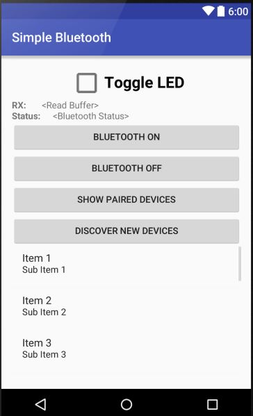

# Android-Simple-Bluetooth-Example

A simple Android bluetooth example to turn on/off the radio and to view and connect with other devices. It has associated embedded firmware code to connect to an Arduino to test the bi-directional data stream.

For a complete tutorial write-up, please see here: 

http://mcuhq.com/27/simple-android-bluetooth-application-with-arduino-example

## Introduction

This is a simple demo app that creates buttons to toggle ON/OFF the bluetooth radio, view connected devices, and to discover new bluetooth enabled devices. A checkbox and status strings provide functionality to communicate with an embedded microcontroller such as an Arduino. You don't necessarily need to connect an Arduino to still have a functioning phone application. The connected device MUST abide by the Serial Port Profile (SPP). Other complex profiles are not supported with this example and will fail to connect. 

## Required Tools

1. [Android Studio IDE and SDK](http://developer.android.com/sdk/index.html)
2. [HC-06 bluetooth module](https://www.olimex.com/Products/Components/RF/BLUETOOTH-SERIAL-HC-06/resources/hc06.pdf)
3. Arudino Uno 
4. A few breadboard wires to connect the HC-06 to the Arduino

## Setup

1. Clone this repo and open it inside of Android Studio. Note, a later SDK will work just fine (SDK 23+)
2. Build the app
3. Install the app to your connected Android phone. You will need to install special drivers and enable USB debugging on your phone for this to work. There are plenty of tutorials on the web for this.
4. [Clone this Arudino gist](https://gist.github.com/bauerjj/424442ed08647a26652f9fe0736bfa28) and program your Arudino
5. Run the application on your phone after it installs. Connect to the HC-06 and you should see a number incrementing on the application every second. 

## Issues

Please submit all issues to the github tracker. Pull requests are also encouraged. General comments can be left either inside github or at [mcuhq.com](http://mcuhq.com/27/simple-android-bluetooth-application-with-arduino-example).

